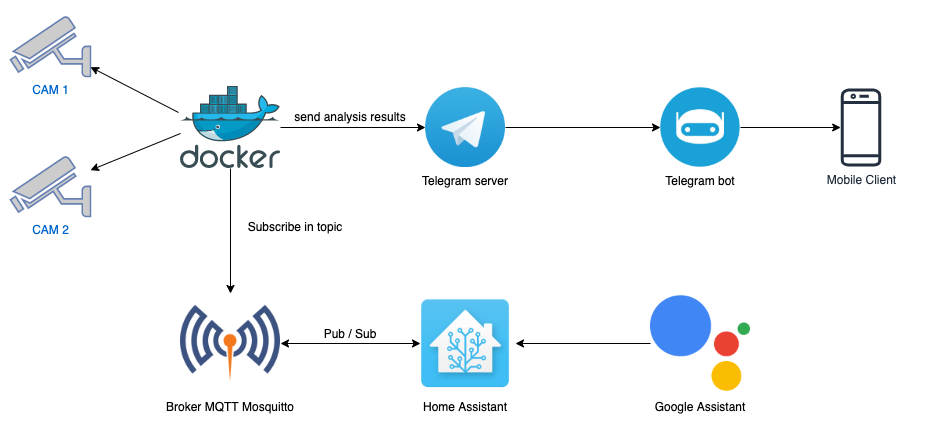

# Smart Security Camera

This project analyze real time CCTV images with Convolutional Neural Networks. 

The application uses neural network models to analyze RTSP (Real Time Streaming Protocol) video streams using OpenCV / Darknet, Google Assistant and sends the results with a Telegram Bot.



The architecture uses resources like:

- Home Assistant
- Broker MQTT (Mosquitto)
- Google Assistant
- Docker
- Telegram Bot

## How to use

### Install requirements

```bash
poetry install

# or with pip
pip install -r requirements.txt
```

### Credentials

Create file .env in _smart_security_camera/config/_

```bash
TOPIC=<YOUR TOPIC HERE>
BROKER_PORT=<YOUR BROKER PORT HERE>
BROKER_USER=<YOUR BROKER USER HERE>
BROKER_PASSWORD=<YOUR BROKER PASSWORD HERE>
BROKER_ADDRESS=<YOUR BROKER ADDRESS HERE>
TELEGRAM_TOKEN=<YOUR TELEGRAM TOKEN HERE>
TELEGRAM_CHAT_ID=<YOUR TELEGRAM CHAT ID HERE>
CHANNELS=<YOUR CHANNELS HERE>
RTSP_URL=<YOUR RTSP URL HERE>
```

### Get weight file from Darknet

```bash
/smart_security_camera/services/model/get_weight_file.sh
```

### Running with Docker

```bash
docker-compose up -d
```